<header>
  
</header>

  <picture>
    <!-- Dark mode: light text -->
    <source media="(prefers-color-scheme: dark)" srcset="https://readme-typing-svg.herokuapp.com?color=F0F6FC&size=28&center=true&vCenter=true&width=1000&lines=Hey+there,+I'm+Th%C3%A1ssio;Robotics+%E2%80%94+ROS2+%E2%80%94+VIO%2FSLAM+%E2%80%94+Embedded;Computer+Engineering+Student;Welcome!">
    <!-- Light mode: dark text -->
    <source media="(prefers-color-scheme: light)" srcset="https://readme-typing-svg.herokuapp.com?color=0A0A0A&size=28&center=true&vCenter=true&width=1000&lines=Hey+there,+I'm+Th%C3%A1ssio;Robotics+%E2%80%94+ROS2+%E2%80%94+VIO%2FSLAM+%E2%80%94+Embedded;Computer+Engineering+Student;Welcome!">
    <!-- Fallback -->
    
  </picture>

  
  &nbsp;
  

---

## 👋 About me

I’m **Thássio Silva**, a **Computer Engineering** student focused on **robotics, computer vision, and embedded systems**. Here you’ll find code and PoCs powering my academic, competition, and community projects — from **UAV/VIO/SLAM** with ROS2 to **low-altitude geospatial pipelines**, plus a full **Next.js + Firebase** platform for my community.

- 🤖 **Robotics/UAV:** ROS2 nodes, VIO/SLAM, **EKF**, control, and QoS tuning  
- 🛰️ **Geo pipelines:** **GeoVPR/GeoMap** (DJI Mini 3, Mapillary, Google Earth Engine, CBERS-4A)  
- 🌐 **Web:** **Next.js + Firebase/Firestore** (IEADSM) with auth, rules, Cloud Functions  
- 🔌 **Embedded:** **STM32/ESP32**, **NRF24L01+**, PCBs, drivers, VHDL/Verilog  
- 📶 **IoT/Networking:** **LoRaWAN + SCHC** (RFC 8724/9011) simulations and prototypes  

> See full context, screenshots and demos: **[thxssio.com](https://www.thxssio.com/)**

---

## 🚀 What I’m working on

- **SuperVIO (ROS2):** VO/SLAM, sensor fusion, and visualization  
- **VSSS (Very Small Size Soccer):** motion control (PWM/H-bridge TB6612FNG), vision, strategy  
- **IEADSM portal:** Next.js 15 + Firebase/Firestore (CPF-based signup, family linking & auto-merge with Cloud Functions, AppCheck, rules)  
- **GeoVPR/GeoMap:** low-altitude capture, visual matching, Earth Engine analysis  
- **LoRaWAN + SCHC:** RFC-based studies and proof-of-concepts  

---

## 🧰 Tech stack

### Languages
&nbsp;
&nbsp;
&nbsp;
&nbsp;

### Frameworks & Tools
&nbsp;
&nbsp;
&nbsp;
&nbsp;
&nbsp;
&nbsp;

### Robotics & Embedded
&nbsp;
&nbsp;
&nbsp;
&nbsp;

---

## ⭐ Featured projects

- **SuperVIO (ROS2)** — VO/SLAM, sensor fusion and visualization  
- **VSSS** — mobile-robot framework (control, vision and strategy)  
- **IEADSM Portal** — Next.js + Firebase/Firestore (CPF signup, family linking/auto-merge)  
- **GeoVPR/GeoMap** — low-altitude mapping and visual place recognition  
- **SCHC/LoRaWAN** — RFC-driven prototypes and tests  

> Portfolio and case studies: **[thxssio.com](https://www.thxssio.com/project)**

---

## 🏆 Achievements (selection)

- 🥇 **FIRA World Cup**  
- 🥇 **Brazilian Robotics Olympiad (OBR)**  
- 🥇 **International Robotics Tournaments**  
- 🥇 **RoboParty — Portugal**  
- 🥇 **Brazilian Robotics Competition — University League (São Paulo)**  
- 🥇 **OBMEP, OBF and OBA (IEMA)**  
- 🥇 **FIRST LEGO League (FLL)**  

> **Drone Pilot License** ✅

---

## 📊 Stats

  
  
  
  

---

## 🌐 Find me

  
  
  
  
  

<!-- SNAKE CONTRIBUTION (requires generated SVG in the repo) -->
<picture>
  <source media="(prefers-color-scheme: dark)" srcset="github-contribution-grid-snake-dark.svg">
  <source media="(prefers-color-scheme: light)" srcset="github-contribution-grid-snake.svg">
  
</picture>

  

<footer>
  
</footer>
